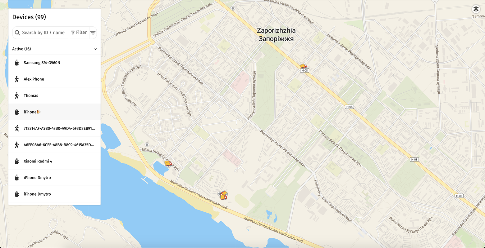

# HyperTrack Views for ReactJS

A wrapper for views provided through the [HyperTrack dashboard](https://dashboard.hypertrack.com/). It allows you to integrate the same views into your own application.

> Please check out the [Views Guide](https://docs.hypertrack.com/#views) for a closer look at the capabilities provided by HyhperTrack Views.



## Prerequisites

- Set up a HyperTrack account and obtain your [Publishable Key from the Dashboard](https://dashboard.hypertrack.com/setup)
- Integrate the HyperTrack SDK in your application ([iOS](https://github.com/hypertrack/quickstart-ios), [Android](https://github.com/hypertrack/quickstart-android), or [React Native](https://github.com/hypertrack/quickstart-react-native)) or use our sample app to send location data ([iOS](https://github.com/hypertrack/live-app-ios) or [Android](https://github.com/hypertrack/live-app-android))

## Installing

You can use either Yarn or NPM to add `hypertrack-views-react` to your project:

```shell
npm install --save hypertrack-views-react

yarn add hypertrack-views-react
```

## Usage

```javascript
import { LiveView } from "hypertrack-views-react";

const PUBLISHABLE_KEY = "<your_key>";

<LiveView
  publishableKey={PUBLISHABLE_KEY}
  isTooltipsShown={false}
  isDeviceListShown={false}
  selectedDeviceId={null}
  defaultLayer={"street"}
  customLayer={"Optional prop for changing map tiles here"}
  assetsUrl={"https://abc-sdk-test-assets.s3-us-west-2.amazonaws.com/"}
/>;
```

### Configuration

| Property          | Type    | Default | Description                                                                                                                                                                                                                                              |
| ----------------- | ------- | ------- | -------------------------------------------------------------------------------------------------------------------------------------------------------------------------------------------------------------------------------------------------------- |
| publishableKey    | string  | N/A     | The publishable key of your account from the [Setup page on the Dashboard](https://dashboard.hypertrack.com/setup)                                                                                                                                       |
| isTooltipsShown   | boolean | `false` | Show the device ID right next to the location marker of a device                                                                                                                                                                                         |
| isDeviceListShown | boolean | `true`  | Show the list of all tracked devices, includes filter and search options. A click on a device will put the device in focus (zoom)                                                                                                                        |
| selectedDeviceId  | string  | `null`  | ID of the device to be displayed. Adding this will change the view to a single device mode (including device data, activity, and more)                                                                                                                   |
| defaultLayer      | string  | `base`  | Can be either one of: [`base`](https://cloud.maptiler.com/maps/voyager/), [`street`](https://cloud.maptiler.com/maps/streets/), [`satellite`](https://cloud.maptiler.com/maps/hybrid/), or `custom`. Custom will only work if a customLayer is provided. |
| customLayer       | string  | `null`  | Leaflet-compatible [tiled web map](https://en.wikipedia.org/wiki/Tiled_web_map) (only raster is supported). Needs to be public accessible.                                                                                                               |
| assetsUrl         | string  | `null`  | URL to a public asset folder containig SVG files to replace default icons. The filenames need to match exactly. Missing files will default to the default                                                                                                |

> Note: The component passes along all additional properties, so you can use properties like `className`.

#### Replacing default icons

By default, the views display a set of icons to indicate status, activity, and more. You can replace each icon individually. Below is a list of all the replaceable icons.

**Original Icons**: You can use the [default icons](i) and make your modifications

| Filename             | Default                                                                                                     | Description                                               |
| -------------------- | ----------------------------------------------------------------------------------------------------------- | --------------------------------------------------------- |
| `live-direction.svg` |  | Dot indicated the live location and direction of a device |
| `live.svg`           |                      | Dot indicated the live location of a device               |
| `offline.svg`        |                | Dot indicated the last known location of a device         |
| `walk.svg`           |                      | Activity icon for walking activity                        |
| `run.svg`            |                        | Activity icon for running activity                        |
| `cycle.svg`          |                    | Activity icon for cycling activity                        |
| `drive.svg`          |                    | Activity icon for driving activity                        |
| `stop.svg`           |                      | Activity icon for stopping activity                       |
| `unknown.svg`        |                | Activity icon for unknown activity                        |
| `inactive.svg`       |              | Status icon for inactive device                           |
| `disconnected.svg`   |      | Status icon for disconnected device                       |

## Versioning

We use [Semantic Versioning](http://semver.org/). For the versions available, see the [tags on this repository](https://github.com/hypertrack/views-react/tags).

## License

This project is licensed under the MIT License - see the [LICENSE](LICENSE) file for details
